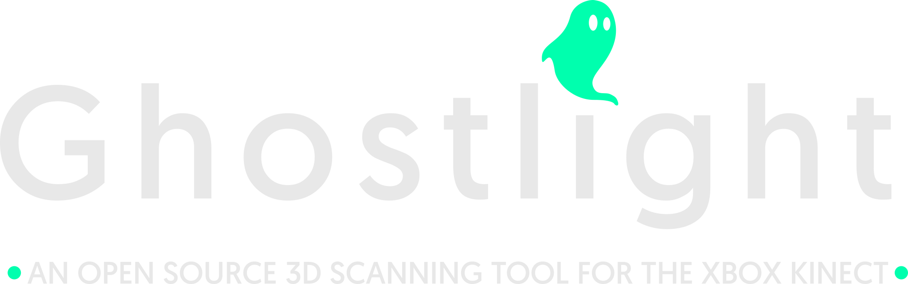
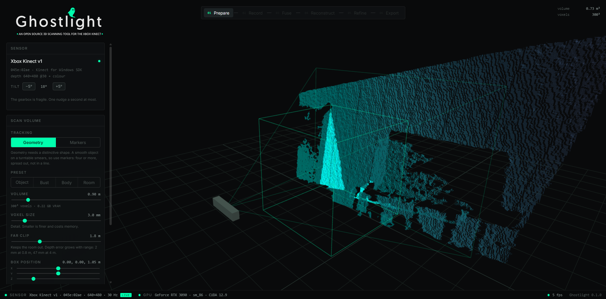

  

---

Open-source 3D scanning for the original Xbox Kinect, running on modern Nvidia GPUs and Windows.

Ghostlight is a GPU TSDF scanner built around the Kinect v1. It records the raw depth and colour frames, reconstructs them separately, provides a browser-based workflow for cleanup, and exports the result as a standard 3D mesh.

---

  

---

[Install and setup](INSTALL.md) · [How it works](TECHNICAL.md) · [Third-party notices](THIRD-PARTY-NOTICES.md)

<h2 align="center">Why this exists</h2>

The Kinect v1 hardware still works, but most of the software around it has not aged well.

Skanect was one of the better options for Kinect scanning, but it has been discontinued. Its CUDA kernels were compiled for `sm_30` through `sm_75` without embedded PTX, which prevents them from running on newer GPU architectures and results in `cudaErrorNoKernelImageForDevice`.

The old OpenNI and NiTE stacks have similar problems on current systems, particularly on Windows so the decision was made to use the `Microsoft Kinect for Windows SDK 1.8` .

The Kinect itself provides 640x480 depth at 30 Hz with a registered colour stream, and used units are easy to find.

Ghostlight replaces the old software stack while keeping the original sensor.

<h2 align="center">What it does</h2>

The workflow is split into six stages:

| Stage | What happens |
|---|---|
| **Prepare** | Set the scan volume and choose geometry or marker tracking |
| **Record** | Capture depth frames, build a live TSDF preview, and save the raw frames |
| **Fuse** | Rebuild the recording at the voxel size you want |
| **Reconstruct** | Run marching cubes over the TSDF |
| **Refine** | Crop, remove the turntable, remove loose parts, smooth and simplify |
| **Export** | Export STL, PLY, OBJ or GLB |

Recording is separate from reconstruction. The raw frames go to disk during capture, so the same take can be fused again at a finer voxel size without rescanning the object.

---

  

---

<h2 align="center">Project status</h2>

This is an early release. The core pipeline works and produces meshes, but plenty of it is rough and some of it is broken. I welcome contributors who want to help work on it.

### Working

- Kinect v1 capture through SDK 1.8 on Windows
- 640x480 depth and colour at 30 Hz on real hardware
- GPU TSDF fusion
- Frame-to-model ICP
- Marching cubes for the final surface (CPU, and the slowest step)
- STL, PLY, OBJ and GLB export
- Raw recording and later re-fusion
- Re-fusion at different voxel sizes
- Tracking failure classification
- VRAM estimation and allocation limits
- Marker detection with local contrast thresholding
- Marker physical-size filtering
- Marker plane constraints

### What does not work well

#### Broken

- **Bounding box.** The preset buttons are decoupled from the sliders and the box does not update correctly.
- **Turntable plane fitting and removal.** Unreliable.
- **Scan volume positioning above the turntable.** Unreliable, and tied to the same problem.
- **Colour meshing.** Voxel-averaged colour comes out too muddy to use, so the option has been removed from the interface. Exports are geometry only. Colour is still useful for tracking.

Expect other bugs. Very little of this has been through a second pair of hands.

#### Needs work

- **Tracking.** Usable, but it drifts and loses lock more often than it should.
- **Tracking thresholds.** Calibrated against synthetic scenes with known ground truth. They hold up on the real data tested so far, but the sample is small.
- **Marker tracking on real hardware.** Detection works against recorded frames. The full survey, solve and locked scan has only been demonstrated with synthetic data.
- **Marker viewing angle.** Small markers get hard to detect at shallow angles. 10 mm markers need roughly 40 degrees of elevation. The interface does not warn you.

#### Not built yet

- **Turntable axis tracking.** `geometry.axis_from_poses` already recovers the axis from a sequence of poses, but nothing uses it. Constraining tracking to that axis should remove a lot of turntable drift.
- **Packaging.** Still needs Python, CUDA, Node and a terminal.
- **Tests and CI.** Synthetic scene harnesses exist but have not been committed or wired up.
- **A non-NVIDIA path.** No CPU or OpenCL fusion backend.
- **GPU cleanup.** The current Open3D wheel runs the Refine operations on the CPU.
- **Other sensors.** The backend interface allows for Kinect v2 and RealSense, but neither has been tested, so neither is claimed.
- **One source of front-end state.** Mock state still sits alongside the real state in `src/composables/useSession.js`.

<h2 align="center">Contributing</h2>

Contributions are welcome, and there is plenty here that needs them.

One person cannot test a scanner properly on their own. If you have a Kinect and something goes wrong, a bug report against hardware I do not own is as useful as a patch.

Issues and pull requests are both fine. Everything under What does not work well is fair game, and if you want somewhere specific to start:

- **Turntable axis tracking**  
  `geometry.axis_from_poses` already recovers the axis. Connect it to the tracker and constrain turntable scans to it. Probably the single biggest quality win available right now.

- **The bounding box bugs**  
  Self-contained, front-end only, and you do not need a Kinect to reproduce them. A good first change.

- **A CPU or OpenCL fusion backend**  
  The CUDA kernels in `server/gputsdf.py` are fairly self-contained and are a reasonable starting point for a second implementation. This would open the project up to everyone without an NVIDIA card.

- **Tests and CI**  
  The synthetic scene harnesses exist but are not in the repository yet. Getting the pipeline testable without hardware would help every other change on this list.

- **Other sensors**  
  Kinect v2 and RealSense can sit behind `server/backend.py` alongside the existing backends.

- **Better colour**  
  Sample vertex colour from suitable recorded keyframes instead of averaging it into the TSDF voxels.

[TECHNICAL.md](TECHNICAL.md) covers how the pipeline fits together, and the module docstrings explain most of the less obvious decisions, including things that were tried and thrown away. If you fix something, a short note on what you saw and why the change works is more useful to me than a tidy diff.

If you use AI in your workflow, [AGENTS.md](AGENTS.md) is detailed context of the repo written for that: the layout, the wire protocol, the coordinate conventions, the tunable constants and the parts that might cause issues. Point your assistant at it and it should save you an exploration pass.

<h2 align="center">License</h2>

Ghostlight is licensed under the GNU General Public License v3.0 (GPLv3).
You are free to use, modify and redistribute the project under the terms of the GPLv3. If you distribute modified versions, the corresponding source code must remain available under the same license.
